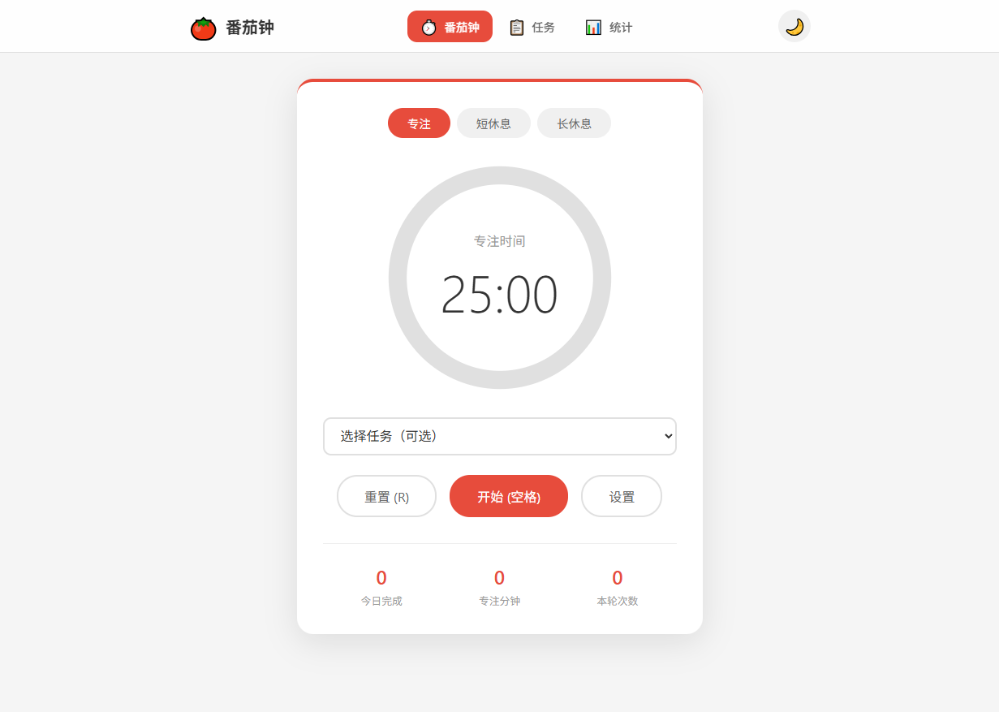
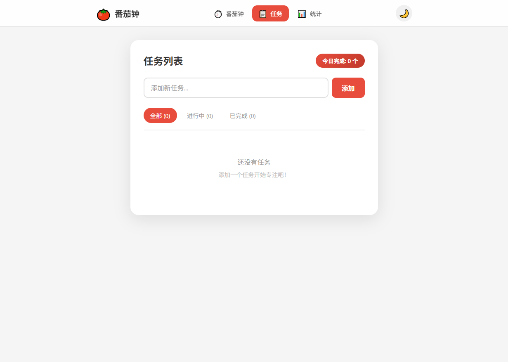
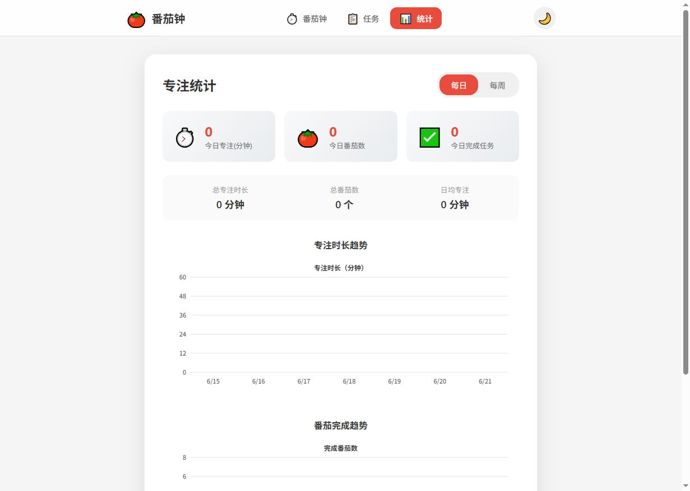

# 🍅 番茄钟 Pomodoro Timer

一个基于 React 的番茄钟应用，支持三种计时模式、任务管理和专注数据统计。

## 本地运行

```bash
npm install
npm start       # 启动 webpack dev server (http://localhost:3000)
npm run build   # 生产构建
```

## 功能说明

- **三种计时模式**：专注（默认 25 分钟）、短休息（5 分钟）、长休息（15 分钟）
- **键盘快捷键**：
  - `空格` — 开始 / 暂停
  - `R` — 重置
- **自动开始下一轮**：设置中开启后，计时结束自动进入下一阶段
- **任务管理**：添加、完成、删除任务，每个番茄钟可绑定任务
- **数据统计**：每日 / 每周专注时长与番茄完成数量图表
- **深浅主题切换**：右上角按钮切换

## 技术栈

- React 18
- CSS Modules
- Webpack 5
- 状态全部持久化到 `localStorage`，无后端依赖

## 项目结构

```
src/
├── components/     # UI 组件（Timer、TaskList、Statistics、ConfirmModal、Navbar）
├── context/        # React Context（ThemeContext 主题管理）
├── utils/          # 工具函数（storage 本地存储、notification 系统通知）
└── styles/         # CSS Modules 样式文件 + global.css
```

## 测试

使用 Jest + React Testing Library，共 58 个测试用例：

```bash
npm test
```

覆盖：
- `src/utils/storage.js` — 存储工具函数
- `Timer`、`TaskList`、`ConfirmModal` — 组件交互逻辑

## 截图

| 番茄钟 | 任务列表 | 数据统计 |
|--------|---------|---------|
|  |  |  |
